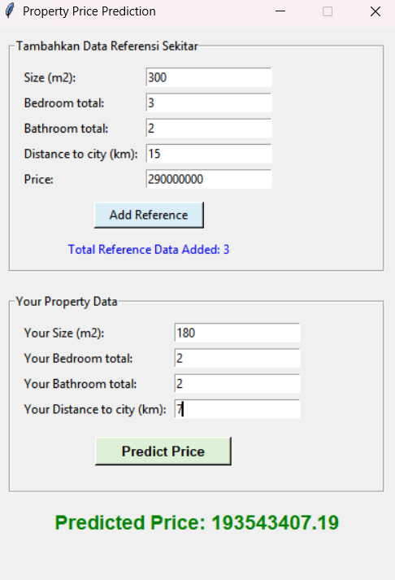

# Property Price Prediction - Python

Saya membuat machine learning dalam bentuk GUI sederhana menggunakan Python dengan library Numpy dan Tkinter. Nantinya pengguna dapat memberikan referensi berupa informasi mengenai luas tanah, jumlah kamar tidur, jumlah kamar mandi, dan jarak ke perkotaan. Pengguna dapat memberikan referensi berupa informasi lebih dari 1 property. Setelah pengguna selesai memberikan referensi berupa informasi, pengguna akan diminta untuk memberi informasi berupa luas tanah, jumlah kamar tidur, jumlah kamar mandi, dan jarak ke perkotaan untuk property yang ingin diprediksi. 

Setelah pengguna memberikan informasi terkait property yang ingin diprediksi, sistem akan mengumpulkan informasi tersebut dalam bentuk matrix yang akan dikalkulasi menggunakan linear algebra untuk mencari hubungan setiap faktor dan akhirnya sistem akan menampilkan harga prediksi untuk property milik pengguna.